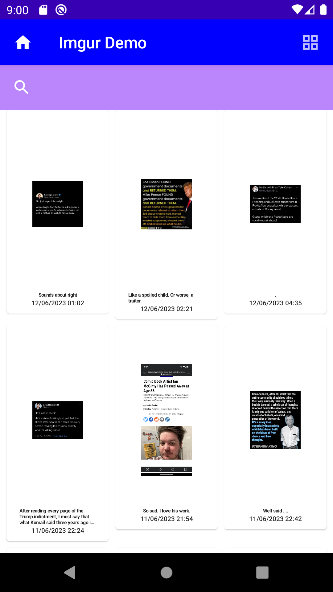

# Imgur_Demo
Project Demostrate use of Imgur API along using Jetpack Compose
https://github.com/vinodbobate25/Imgur_Demo/assets/10657949/aea0e379-dbec-482b-8bdc-c5ff64853134
<p float="left">


</p>


A demo project--


This app demonstrate the use of Imgur API using Jetpack Compose  
## Features

- [x] kotlin AndroidX
- [x] MVVM Architecture
- [x] JetPack Compose
- [x] Hilt Dependency Injection Library
- [x] Flow
- [x] Coroutine
- [x] Jetpack Compose Navigation
- [x] coil
- [x] Retrofit
- [x] Compose State

## Implementations
I have used Jetpack compose in this application .this application follows MVVM architecture along with coroutine and http dagger dependency injection library.
I explored use of compose states to understand how it can be used to recompose the ui on diffrent state changes.
I used Coil library to show images in imageview.


## Description
- Imgur_Demo Application  has two Pages
- Main screen show Top Gallery Image list 
- User can switch between Grid and List view by clicking at Appbar Action Item at the top right of screen
- User can search in list/Grid by using searchbar
- On clicking at Listitem,detail screen will appear


## License
```
Copyright 2020 The Android Open Source Project

Licensed under the Apache License, Version 2.0 (the "License");
you may not use this file except in compliance with the License.
You may obtain a copy of the License at

    https://www.apache.org/licenses/LICENSE-2.0

Unless required by applicable law or agreed to in writing, software
distributed under the License is distributed on an "AS IS" BASIS,
WITHOUT WARRANTIES OR CONDITIONS OF ANY KIND, either express or implied.
See the License for the specific language governing permissions and
limitations under the License.
```


